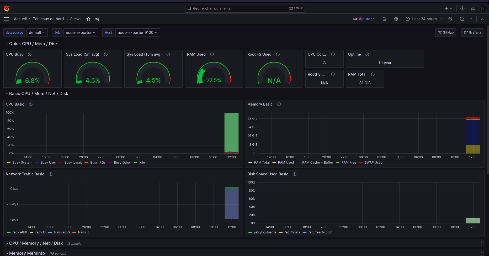

# 🚀 Docker System Dashboard Template 🚀

This repository provides a Docker configuration template for setting up a powerful system dashboard using Grafana, Prometheus, cAdvisor, and Node Exporter. 📊

## Table of Contents

- [Screenshots](#screenshots)
- [Prerequisites](#prerequisites)
- [How to Use](#how-to-use)
- [Additional Configuration](#additional-configuration)
- [Support and Contribution](#support-and-contribution)
- [License](#license)

## Screenshots



## Prerequisites

Ensure you have Docker installed on your system before you begin. If not, you can download it [here](https://www.docker.com/get-started). 🐳

## How to Use

1. **Use the Github Template:**

   Click on the `Use this template` button to create a new repository using this template.

2. **Clone the Repository:**

   ```bash
   git clone <repository-url>
   cd docker-system-dashboard
   ```

3. **Start the Services:**

   ```bash
   docker-compose up -d
   ```

   This command will start Grafana, Prometheus, cAdvisor, and Node Exporter in the background.

4. **Access the Dashboard:**

   - Grafana Dashboard: Open your browser and go to `http://localhost:3000`. Login with the default credentials (username: admin, password: admin) and configure your dashboard with the data from Prometheus.

5. **Customize Your Dashboard:**

   - Modify the `prometheus.yml` configuration file to add additional targets or scrape configurations for Prometheus.

   - Customize Grafana dashboards and panels based on your specific requirements.

## Additional Configuration

- **cAdvisor:** cAdvisor provides container usage metrics. You can access cAdvisor at `http://localhost:8080`.

- **Node Exporter:** Node Exporter collects system-level metrics. Access Node Exporter's metrics at `http://localhost:9100/metrics`.

## Support and Contribution

Feel free to open issues if you encounter problems or have suggestions for improvements. Contributions are welcome!

## 📝 License

This project is licensed under the [MIT License](LICENSE).

---

Feel free to modify the instructions according to your specific setup and requirements!
